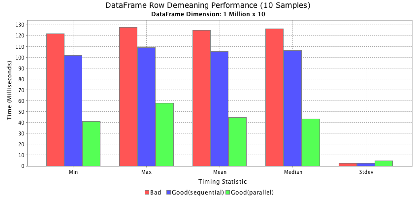
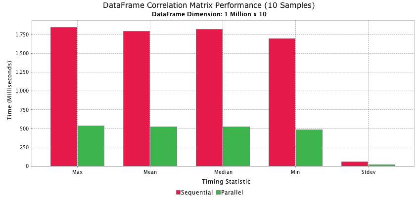

## Descriptive Statistics

### Introduction

Computing descriptive statistics is a fundamental feature of the Morpheus API, and to this end, a package is devoted 
to providing a clean and consistent framework that is then integrated with the Morpheus `Array` and `DataFrame` interfaces. 
All the statistic calculators implement **online algorithms**, so they can be used to compute stats on infinitely large 
datasets. In addition, the Morpheus statistics package can be used standalone, independent of the `Array` and `DataFrame` 
structures.

The table below enumerates the uni-variate statistics currently supported. Computing descriptive statistics on sample 
data reduces dimensionality in that an `Array` can be reduced to a scalar, or stats on `DataFrame` columns can be 
reduced to an array of values representing the statistic for each column. To that end, the [Stats]() interface, which 
exposes all the uni-variate statistics methods, is parameterized by the return type of the functions it declares so that 
it can either return a scalar value, or some other data structure aggregate.

| Method                    | Description                                                                                   | Details
|---------------------------|-----------------------------------------------------------------------------------------------|---------------------------------------------------------------------|
| count()                   | The number of observations, ignoring nulls                                                    |                                                                     |   
| min()                     | The minimum value, ignoring nulls                                                             | [Details](https://en.wikipedia.org/wiki/Sample_maximum_and_minimum) |
| max()                     | The maximim value, ignorning nulls                                                            | [Details](https://en.wikipedia.org/wiki/Sample_maximum_and_minimum) |
| mean()                    | The first moment, or the arithmetic mean or average, ignoring nulls                           | [Details](https://en.wikipedia.org/wiki/Mean)                       |
| variance()                | The un-biased variance or second moment, a measure of dispersion                              | [Details](https://en.wikipedia.org/wiki/Variance)                   |
| stdDev()                  | The un-biased standard deviation, a measure of dispersion                                     | [Details](https://en.wikipedia.org/wiki/Standard_deviation)         |
| skew()                    | The third moment, or skewness, a measure of the asymmetry in the distribution                 | [Details](https://en.wikipedia.org/wiki/Skewness)                   | 
| kurtosis()                | The fourth moment, or Kurtosis, a measure of the "tailedness" of the probability distribution | [Details](https://en.wikipedia.org/wiki/Kurtosis)                   |         
| median()                  | The value separating the higher half of the data, or 50th percentile                          | [Details](https://en.wikipedia.org/wiki/Median)                     |
| mad()                     | The Mean Absolute Deviation from a central point, another measure of dispersion               | [Details](https://en.wikipedia.org/wiki/Average_absolute_deviation) |
| sem()                     | The standard error of the mean                                                                | [Details](https://en.wikipedia.org/wiki/Standard_error)             |
| geoMean()                 | The geometric mean, another measure of central tendency                                       | [Details](https://en.wikipedia.org/wiki/Geometric_mean)             |
| sum()                     | The summation of all values, ignoring nulls                                                   | [Details](https://en.wikipedia.org/wiki/Summation)                  |
| sumOfSquares()            | The sum, over non-null observations, of the squared differences from the mean                 | [Details](https://en.wikipedia.org/wiki/Total_sum_of_squares)       | 
| autocorr(int lag)         | The autocorrelation, which is the correlation of a signal with a delayed copy of itself       | [Details](https://en.wikipedia.org/wiki/Autocorrelation)            |
| percentile(double nth)    | The percentile value below which n% of values fall, ignoring nulls                            | [Details](https://en.wikipedia.org/wiki/Percentile)                 |


The following sections mostly operate on a `DataFrame` of random double precision values with an arbitrary number of
rows and columns, which can be manufactured with the code below. In other examples the motor vehicle dataset introduced 
in the [overview](../../index.html) will be used to demonstrate how statistics functions behave on frames with mixed data types.

<?prettify?>
```java
/**
 * Returns a frame of random double precision values
 * @param rowCount  the row count for frame
 * @param columns   the column keys
 * @return          the newly created frame
 */
static DataFrame<LocalDate,String> random(int rowCount, String... columns) {
    final LocalDate start = LocalDate.now().minusDays(rowCount);
    return DataFrame.ofDoubles(
        Range.of(0, rowCount).map(start::plusDays),
        Array.of(columns),
        value -> Math.random() * 100d
    );
}
```

For example:

<?prettify?>
```java
random(100, "A", "B", "C", "D", "E").out().print(10);
```

<div class="frame"><pre class="frame">
   Index     |       A       |       B       |       C       |       D       |       E       |
----------------------------------------------------------------------------------------------
 2014-04-18  |  27.65695706  |  24.12541112  |  54.53927679  |  29.53942097  |  36.32857957  |
 2014-04-19  |  77.17892101  |  91.65862134  |  31.89758283  |  75.86327696  |  65.28820416  |
 2014-04-20  |  36.11837803  |   3.50787279  |  18.35033145  |  29.87153499  |  89.64915738  |
 2014-04-21  |   6.11609249  |  61.52213182  |   76.0263036  |  91.45821122  |  15.68900718  |
 2014-04-22  |  87.76836565  |   5.14224821  |  97.79979071  |  38.69432549  |  16.94097048  |
 2014-04-23  |  72.72059023  |  89.50857903  |  23.38300753  |  71.09288654  |  20.66341413  |
 2014-04-24  |  84.01645441  |   2.27975471  |    3.4054976  |  75.16447082  |  68.66698321  |
 2014-04-25  |  34.07626388  |  60.48921016  |  12.06511821  |  55.99893352  |  51.31240247  |
 2014-04-26  |  56.80751283  |  36.48578987  |  17.44059537  |  78.88660804  |  77.63219394  |
 2014-04-27  |  92.76964851  |  56.95184403  |    7.3521691  |  27.01594691  |   0.02729372  |
</pre></div>

## Uni-Variate Statistics

### Frame Level Statistics

The `stats()` method on the `DataFrame` interface returns `Stats<Double>` that can be used to compute descriptive
statistics over all values in the frame. The `Stats` interface is parameterised in `Double` to indicate that scalar 
values are generated by all the methods. The code below demonstrate this use case:

<?prettify?>
```java
//Create 100x5 DataFrame of random doubles
DataFrame<Integer,String> frame = random(100, "A", "B", "C", "D", "E");

System.out.printf("Count = %.4f\n", frame.stats().count());
System.out.printf("Minimum = %.4f\n", frame.stats().min());
System.out.printf("Maximum = %.4f\n", frame.stats().max());
System.out.printf("Mean = %.4f\n", frame.stats().mean());
System.out.printf("Median = %.4f\n", frame.stats().median());
System.out.printf("Variance = %.4f\n", frame.stats().variance());
System.out.printf("StdDev = %.4f\n", frame.stats().stdDev());
System.out.printf("Skew = %.4f\n", frame.stats().skew());
System.out.printf("Kurtosis = %.4f\n", frame.stats().kurtosis());
System.out.printf("Mean Abs Deviation = %.4f\n", frame.stats().mad());
System.out.printf("Sum = %.4f\n", frame.stats().sum());
System.out.printf("Sum of Squares = %.4f\n", frame.stats().sumSquares());
System.out.printf("Std Error of Mean = %.4f\n", frame.stats().sem());
System.out.printf("Geometric Mean = %.4f\n", frame.stats().geoMean());
System.out.printf("Percentile(75th) = %.4f\n", frame.stats().percentile(0.75d));
System.out.printf("Autocorrelation(2) = %.4f\n", frame.stats().autocorr(2));
```

<div class="frame"><pre class="frame">
Count = 500.0000
Minimum = 0.0912
Maximum = 99.2049
Mean = 50.4180
Median = 49.8189
Variance = 803.8727
StdDev = 28.3526
Skew = -0.0670
Kurtosis = -1.1654
Mean Abs Deviation = 24.4590
Sum = 25209.0143
Sum of Squares = 1672121.2725
Std Error of Mean = 1.2680
Geometric Mean = 37.1386
Percentile(75) = 75.4636
Autocorrelation(2) = -0.0671
</pre></div>

### Single Row / Column Statistics

The `Stats<Double>` interface can be accessed on individual rows and columns, namely by calling the `stats()` method on the 
`DataFrameRow` or `DataFrameColumn` interface. Individual rows or columns can be accessed via **ordinal** or **key** via the 
`rowAt()` and `colAt()` methods on `DataFrame`, as illustrated below.

<?prettify?>
```java
//Create 100x5 DataFrame of random doubles
DataFrame<LocalDate,String> frame = random(100, "A", "B", "C", "D", "E");

//Capture stats interface for two rows independently sourced by ordinal and key
LocalDate date = frame.rows().key(3);
Stats<Double> stats1 = frame.rowAt(3).stats();
Stats<Double> stats2 = frame.rowAt(date).stats();

StatType.univariate().forEach(statType -> {
    switch (statType) {
        case COUNT:         assert(stats1.count().doubleValue() == stats2.count());                     break;
        case MIN:           assert(stats1.min().doubleValue() == stats2.min());                         break;
        case MAX:           assert(stats1.max().doubleValue() == stats2.max());                         break;
        case MEAN:          assert(stats1.mean().doubleValue() == stats2.mean());                       break;
        case MEDIAN:        assert(stats1.median().doubleValue() == stats2.median());                   break;
        case VARIANCE:      assert(stats1.variance().doubleValue() == stats2.variance());               break;
        case STD_DEV:       assert(stats1.stdDev().doubleValue() == stats2.stdDev());                   break;
        case KURTOSIS:      assert(stats1.kurtosis().doubleValue() == stats2.kurtosis());               break;
        case MAD:           assert(stats1.mad().doubleValue() == stats2.mad());                         break;
        case SEM:           assert(stats1.sem().doubleValue() == stats2.sem());                         break;
        case GEO_MEAN:      assert(stats1.geoMean().doubleValue() == stats2.geoMean());                 break;
        case SUM:           assert(stats1.sum().doubleValue() == stats2.sum());                         break;
        case SUM_SQUARES:   assert(stats1.sumSquares().doubleValue() == stats2.sumSquares());           break;
        case AUTO_CORREL:   assert(stats1.autocorr(2).doubleValue() == stats2.autocorr(2));             break;
        case PERCENTILE:    assert(stats1.percentile(0.75).doubleValue() == stats2.percentile(0.75));   break;
    }
});
```

Given the symmetrical nature of the Morpheus `DataFrame` API, the exact same approach follows in the column dimension.

<?prettify?>
```java
//Create 100x5 DataFrame of random doubles
DataFrame<LocalDate,String> frame = random(100, "A", "B", "C", "D", "E");

//Capture stats interface for two columns independently sourced by ordinal and key
Stats<Double> stats1 = frame.colAt(3).stats();
Stats<Double> stats2 = frame.colAt("D").stats();

StatType.univariate().forEach(statType -> {
    switch (statType) {
        case COUNT:         assert(stats1.count().doubleValue() == stats2.count());                     break;
        case MIN:           assert(stats1.min().doubleValue() == stats2.min());                         break;
        case MAX:           assert(stats1.max().doubleValue() == stats2.max());                         break;
        case MEAN:          assert(stats1.mean().doubleValue() == stats2.mean());                       break;
        case MEDIAN:        assert(stats1.median().doubleValue() == stats2.median());                   break;
        case VARIANCE:      assert(stats1.variance().doubleValue() == stats2.variance());               break;
        case STD_DEV:       assert(stats1.stdDev().doubleValue() == stats2.stdDev());                   break;
        case KURTOSIS:      assert(stats1.kurtosis().doubleValue() == stats2.kurtosis());               break;
        case MAD:           assert(stats1.mad().doubleValue() == stats2.mad());                         break;
        case SEM:           assert(stats1.sem().doubleValue() == stats2.sem());                         break;
        case GEO_MEAN:      assert(stats1.geoMean().doubleValue() == stats2.geoMean());                 break;
        case SUM:           assert(stats1.sum().doubleValue() == stats2.sum());                         break;
        case SUM_SQUARES:   assert(stats1.sumSquares().doubleValue() == stats2.sumSquares());           break;
        case AUTO_CORREL:   assert(stats1.autocorr(2).doubleValue() == stats2.autocorr(2));             break;
        case PERCENTILE:    assert(stats1.percentile(0.75).doubleValue() == stats2.percentile(0.75));   break;
    }
});
```

#### Demean Rows

Consider an example where we would like to demean the `DataFrame` in question along the row dimension, that is to say,
we wish to compute the mean for each row, and subtract that amount from each item in the row.  This could be achieveed
as follows.

<?prettify?>
```java
//GOOD: Row iteration using forEach()
frame.rows().forEach(row -> {
    final double mean = row.stats().mean();
    row.applyDoubles(v -> {
        return v.getDouble() - mean;
    });
});
```

In this scenario, the row object which serves as the lambda argument is reused across each invocation, as is the `Stats` object,
making this extremely efficient. A much less efficient mechanism would be to create a new row and new `Stats` object for each
iteration through the loop as shown below. To see how performance of these approaches compares, see section below on 
[performance](#performance).

<?prettify?>
```java
//BAD: Row iteration creating a new row each time
for (int i=0; i<frame.rowCount(); ++i) {
    final DataFrameRow<LocalDate,String> row = frame.rowAt(i);
    final double mean = row.stats().mean();
    row.applyDoubles(v -> {
        return v.getDouble() - mean;
    });
}
```

### Multiple Row / Column Statistics

Calculating descriptive statistics in batch for all rows or columns is also supported by the Morpheus API. There are two
mechanisms which can be used to achieve this, the first is via the `stats()` method on `DataFrameRows` or `DataFrameColumns`,
and the second is via the `describe()` method.

The same `Stats<?>` interface described earlier is returned from `DataFrameRows.stats()` but in this case it is parameterized
as `Stats<DataFrame<R,C>>` as this implementation yields a `DataFrame` of values rather than a scalar value. In our example,
`DataFrame<LocalDate,String>` row statistics will be presented as `DataFrame<LocalDate,StatType>` and column statistics will 
be presented as `DataFrame<StatType,String>`. Consider the following code for accessing bulk row statistics:

<?prettify?>
```java
//Create 10x5 DataFramem of random doubles
DataFrame<LocalDate,String> frame = random(10, "A", "B", "C", "D", "E");

DataFrame<LocalDate,StatType> count = frame.rows().stats().count();
DataFrame<LocalDate,StatType> min = frame.rows().stats().min();
DataFrame<LocalDate,StatType> max = frame.rows().stats().max();
DataFrame<LocalDate,StatType> mean = frame.rows().stats().mean();
DataFrame<LocalDate,StatType> median = frame.rows().stats().median();
DataFrame<LocalDate,StatType> variance = frame.rows().stats().variance();
DataFrame<LocalDate,StatType> stdDev = frame.rows().stats().stdDev();
DataFrame<LocalDate,StatType> kurtosis = frame.rows().stats().kurtosis();
DataFrame<LocalDate,StatType> mad = frame.rows().stats().mad();
DataFrame<LocalDate,StatType> sum = frame.rows().stats().sum();
DataFrame<LocalDate,StatType> sumLogs = frame.rows().stats().sumLogs();
DataFrame<LocalDate,StatType> sumSquares = frame.rows().stats().sumSquares();
DataFrame<LocalDate,StatType> sem = frame.rows().stats().sem();
DataFrame<LocalDate,StatType> geoMean = frame.rows().stats().geoMean();
DataFrame<LocalDate,StatType> autocorr = frame.rows().stats().autocorr(1);
DataFrame<LocalDate,StatType> percentile = frame.rows().stats().percentile(0.75d);
```
To illustrate what one of these frames looks like, let us look at the kurtosis results:

<?prettify?>
```java
kurtosis.out().print();
```

<div class="frame"><pre class="frame">
   Index     |   KURTOSIS    |
------------------------------
 2014-04-18  |    0.9224301  |
 2014-04-19  |  -1.03762054  |
 2014-04-20  |  -2.19408392  |
 2014-04-21  |  -1.60940179  |
 2014-04-22  |   0.33646256  |
 2014-04-23  |  -2.79071762  |
 2014-04-24  |  -2.34090553  |
 2014-04-25  |  -2.76200702  |
 2014-04-26  |  -1.62476724  |
 2014-04-27  |   -1.6700161  |
</pre></div>

Alternatively, we can also create a single `DataFrame` with multiple row statistics using the `describe()` method as follows:

<?prettify?>
```java
DataFrame<LocalDate,StatType> rowStats = frame.rows().describe(
    StatType.COUNT, StatType.MEAN, StatType.VARIANCE, StatType.SKEWNESS, StatType.SUM
);
```

<div class="frame"><pre class="frame">
   Index     |  COUNT   |     MEAN      |    VARIANCE     |   SKEWNESS    |      SUM       |
--------------------------------------------------------------------------------------------
 2014-04-18  |  5.0000  |   72.4181454  |   619.98499044  |   0.21026915  |  362.09072702  |
 2014-04-19  |  5.0000  |  43.53540087  |  1224.58077656  |   1.31797636  |  217.67700434  |
 2014-04-20  |  5.0000  |  72.50600374  |   1144.3222537  |  -1.42186326  |  362.53001871  |
 2014-04-21  |  5.0000  |  76.15303235  |   398.36488382  |  -0.09378226  |  380.76516176  |
 2014-04-22  |  5.0000  |  72.31809543  |   808.83023776  |   -1.2161613  |  361.59047717  |
 2014-04-23  |  5.0000  |  57.73293757  |   746.28716947  |    0.0998814  |  288.66468783  |
 2014-04-24  |  5.0000  |  55.14827133  |  1253.77051383  |  -0.48490569  |  275.74135666  |
 2014-04-25  |  5.0000  |  27.59810985  |   857.21698695  |    1.7015654  |  137.99054927  |
 2014-04-26  |  5.0000  |  50.02524398  |     7.73321175  |   0.74564028  |  250.12621991  |
 2014-04-27  |  5.0000  |  33.56051921  |   843.19166011  |   1.55424455  |  167.80259607  |
</pre></div>

The symmetrical nature of the Morpheus API means that bulk column statistics work in exactly the same way, except the resulting
`DataFrame` is transposed and parameterized in this example as `DataFrame<StatType,String>`. For completeness, consider the
analogous column based code:

<?prettify?>
```java
//Create 100x5 DataFrame of random double precision values
DataFrame<LocalDate,String> frame = random(100, "A", "B", "C", "D", "E");

DataFrame<StatType,String> count = frame.cols().stats().count();
DataFrame<StatType,String> min = frame.cols().stats().min();
DataFrame<StatType,String> max = frame.cols().stats().max();
DataFrame<StatType,String> mean = frame.cols().stats().mean();
DataFrame<StatType,String> median = frame.cols().stats().median();
DataFrame<StatType,String> variance = frame.cols().stats().variance();
DataFrame<StatType,String> stdDev = frame.cols().stats().stdDev();
DataFrame<StatType,String> kurtosis = frame.cols().stats().kurtosis();
DataFrame<StatType,String> mad = frame.cols().stats().mad();
DataFrame<StatType,String> sum = frame.cols().stats().sum();
DataFrame<StatType,String> sumLogs = frame.cols().stats().sumLogs();
DataFrame<StatType,String> sumSquares = frame.cols().stats().sumSquares();
DataFrame<StatType,String> sem = frame.cols().stats().sem();
DataFrame<StatType,String> geoMean = frame.cols().stats().geoMean();
DataFrame<StatType,String> autocorr = frame.cols().stats().autocorr(1);
DataFrame<StatType,String> percentile = frame.cols().stats().percentile(0.75d);
```

To illustrate the resulting structure, let us print the percentile `DataFrame` to standard out as follows:

<?prettify?>
```java
percentile.out().print();
```

<div class="frame"><pre class="frame">
   Index     |       A       |       B       |       C       |       D       |       E       |
----------------------------------------------------------------------------------------------
 PERCENTILE  |  84.53057879  |  69.39927582  |  71.70889746  |  77.60914534  |  77.43947475  |
</pre></div>

Finally, the `describe()` method on `DataFrameColumns` can be used in the same way as demonstrated earlier to yield multiple 
descriptive statistics on all columns in the frame.
 
<?prettify?>
```java
DataFrame<StatType,String> colStats = frame.cols().describe(
    StatType.COUNT, StatType.MEAN, StatType.VARIANCE, StatType.SKEWNESS, StatType.SUM
);
```

<div class="frame"><pre class="frame">
  Index    |        A        |        B        |        C        |        D        |        E        |
------------------------------------------------------------------------------------------------------
    COUNT  |       100.0000  |       100.0000  |       100.0000  |       100.0000  |       100.0000  |
     MEAN  |    53.21193611  |    46.66050934  |    47.30513686  |    52.83602104  |     53.5188048  |
 VARIANCE  |   1008.5668979  |   710.21278243  |    860.7008831  |   803.54694593  |   886.26568961  |
 SKEWNESS  |    -0.18291634  |     0.08827897  |     0.02910395  |    -0.05554874  |    -0.05292841  |
      SUM  |  5321.19361134  |  4666.05093406  |  4730.51368606  |  5283.60210399  |  5351.88047967  |
</pre></div>

### Expanding Window Statistics

It is often useful to compute summary statistics over an **expanding window**, and the Morpheus API provides a clean and
consistent mechanism for doing this by again leveraging the `Stats<?>` interface. This means all the univariate statistics
discussed above can be calculated in an expanding window fashion, in either the row or column dimension. The code below 
demonstrates how to compute an expanding window mean of a `DataFrame` of random doubles, with a minimum window size of 
5 periods. Calling the `expanding()` method on the `DataFrameAxisStas<R,C>` presents a `Stats<?>` implementation with
expanding window semantics.

<?prettify?>
```java
DataFrame<LocalDate,String> frame = random(100, "A", "B", "C", "D", "E");
DataFrame<LocalDate,String> expandingMean = frame.cols().stats().expanding(5).mean();
expandingMean.out().print(10);
```

The first 10 rows of the results are shown below. Given that we specified a **minimum window size** of 5 periods, the first
4 rows of the result contains NaN values, with the expanding means beginning in the 5th row.

<div class="frame"><pre class="frame">
   Index     |       A       |       B       |       C       |       D       |       E       |
----------------------------------------------------------------------------------------------
 2014-04-18  |          NaN  |          NaN  |          NaN  |          NaN  |          NaN  |
 2014-04-19  |          NaN  |          NaN  |          NaN  |          NaN  |          NaN  |
 2014-04-20  |          NaN  |          NaN  |          NaN  |          NaN  |          NaN  |
 2014-04-21  |          NaN  |          NaN  |          NaN  |          NaN  |          NaN  |
 2014-04-22  |  37.47079054  |  44.65618465  |  34.44764118  |  27.31206568  |  36.88510609  |
 2014-04-23  |  37.90629169  |  41.12951198  |  37.81200548  |  32.72777564  |  37.89339758  |
 2014-04-24  |  35.45602666  |  46.58345677  |  38.53475246  |  32.08935944  |   39.4862089  |
 2014-04-25  |  34.89378526  |  47.23091383  |  41.02249931  |  32.98138908  |  35.84038259  |
 2014-04-26  |  40.93359834  |  43.69633714  |  46.76153667  |  36.59786248  |  36.64151385  |
 2014-04-27  |  38.62418036  |  48.01872857  |  48.72740658  |  39.21108838  |  40.22726792  |
</pre></div>

### Rolling Window Statistics

It is often useful to compute summary statistics over a **rolling window**, and the Morpheus API provides a clean and
consistent mechanism for doing this by again leveraging the `Stats<?>` interface. This means all the univariate statistics
discussed above can be calculated in an rolling window fashion, in either the row or column dimension. The code below 
demonstrates how to compute an rolling window mean of a `DataFrame` of random doubles based on a window size of 5 periods. 
Calling the `rolling()` method on the `DataFrameAxisStas<R,C>` presents a `Stats<?>` implementation with rolling window 
semantics.

<?prettify?>
```java
DataFrame<LocalDate,String> frame = random(100, "A", "B", "C", "D", "E");
DataFrame<LocalDate,String> rollingMean = frame.cols().stats().rolling(5).mean();
rollingMean.out().print(10);
```

The first 10 rows of these results are shown below. As with the expanding window functionality, the first 4 rows are NaN
because we require at least a window size of 5 periods to yield a statistic.

<div class="frame"><pre class="frame">
   Index     |       A       |       B       |       C       |       D       |       E       |
----------------------------------------------------------------------------------------------
 2014-04-18  |          NaN  |          NaN  |          NaN  |          NaN  |          NaN  |
 2014-04-19  |          NaN  |          NaN  |          NaN  |          NaN  |          NaN  |
 2014-04-20  |          NaN  |          NaN  |          NaN  |          NaN  |          NaN  |
 2014-04-21  |          NaN  |          NaN  |          NaN  |          NaN  |          NaN  |
 2014-04-22  |  48.86861615  |  49.43076987  |   23.0890681  |  46.37806901  |  31.72173443  |
 2014-04-23  |  52.82603467  |  48.62150116  |  25.05736597  |   56.4940296  |  36.89243443  |
 2014-04-24  |  55.63736749  |  56.85719458  |  24.74022673  |  71.88998581  |  31.63059599  |
 2014-04-25  |  49.84144271  |  66.44284853  |  24.44921746  |  68.55549636  |  37.57049639  |
 2014-04-26  |  50.72266995  |  79.98150692  |  39.67256206  |  60.98038021  |  48.18298467  |
 2014-04-27  |  44.80180275  |  85.26550794  |  29.06426259  |  55.54849227  |  61.27390254  |
</pre></div>

### Non-Numeric Data Handling

The Morpheus statistics API always presents results as `double` precision values, however it can operate on `int` and `long`
input values by making the appropriate casts. Attempting to compute statistics on non-numeric data will result in an `Exception`, 
however when computing bulk row or column statistics, Morpheus will automatically restrict its operations to numeric vectors.

For example, consider the motor vehicle dataset first introduced in the [overview](../../index.html) which has a number of
non-numeric columns such as `Manufacturer`, `Model`, `Type` and so on. The first 10 rows of the dataset are shown below.
 
<div class="frame"><pre class="frame">
  Index  |  Manufacturer  |    Model     |   Type    |  Min.Price  |   Price   |  Max.Price  |  MPG.city  |  MPG.highway  |       AirBags        |  DriveTrain  |  Cylinders  |  EngineSize  |  Horsepower  |  RPM   |  Rev.per.mile  |  Man.trans.avail  |  Fuel.tank.capacity  |  Passengers  |  Length  |  Wheelbase  |  Width  |  Turn.circle  |  Rear.seat.room  |  Luggage.room  |  Weight  |  Origin   |        Make        |
 -----------------------------------------------------------------------------------------------------------------------------------------------------------------------------------------------------------------------------------------------------------------------------------------------------------------------------------------------------------------------------------------------------------------------------------
      0  |         Acura  |     Integra  |    Small  |    12.9000  |  15.9000  |    18.8000  |        25  |           31  |                None  |       Front  |          4  |      1.8000  |         140  |  6300  |          2890  |              Yes  |             13.2000  |           5  |     177  |        102  |     68  |           37  |            26.5  |            11  |    2705  |  non-USA  |     Acura Integra  |
      1  |         Acura  |      Legend  |  Midsize  |    29.2000  |  33.9000  |    38.7000  |        18  |           25  |  Driver & Passenger  |       Front  |          6  |      3.2000  |         200  |  5500  |          2335  |              Yes  |             18.0000  |           5  |     195  |        115  |     71  |           38  |              30  |            15  |    3560  |  non-USA  |      Acura Legend  |
      2  |          Audi  |          90  |  Compact  |    25.9000  |  29.1000  |    32.3000  |        20  |           26  |         Driver only  |       Front  |          6  |      2.8000  |         172  |  5500  |          2280  |              Yes  |             16.9000  |           5  |     180  |        102  |     67  |           37  |              28  |            14  |    3375  |  non-USA  |           Audi 90  |
      3  |          Audi  |         100  |  Midsize  |    30.8000  |  37.7000  |    44.6000  |        19  |           26  |  Driver & Passenger  |       Front  |          6  |      2.8000  |         172  |  5500  |          2535  |              Yes  |             21.1000  |           6  |     193  |        106  |     70  |           37  |              31  |            17  |    3405  |  non-USA  |          Audi 100  |
      4  |           BMW  |        535i  |  Midsize  |    23.7000  |  30.0000  |    36.2000  |        22  |           30  |         Driver only  |        Rear  |          4  |      3.5000  |         208  |  5700  |          2545  |              Yes  |             21.1000  |           4  |     186  |        109  |     69  |           39  |              27  |            13  |    3640  |  non-USA  |          BMW 535i  |
      5  |         Buick  |     Century  |  Midsize  |    14.2000  |  15.7000  |    17.3000  |        22  |           31  |         Driver only  |       Front  |          4  |      2.2000  |         110  |  5200  |          2565  |               No  |             16.4000  |           6  |     189  |        105  |     69  |           41  |              28  |            16  |    2880  |      USA  |     Buick Century  |
      6  |         Buick  |     LeSabre  |    Large  |    19.9000  |  20.8000  |    21.7000  |        19  |           28  |         Driver only  |       Front  |          6  |      3.8000  |         170  |  4800  |          1570  |               No  |             18.0000  |           6  |     200  |        111  |     74  |           42  |            30.5  |            17  |    3470  |      USA  |     Buick LeSabre  |
      7  |         Buick  |  Roadmaster  |    Large  |    22.6000  |  23.7000  |    24.9000  |        16  |           25  |         Driver only  |        Rear  |          6  |      5.7000  |         180  |  4000  |          1320  |               No  |             23.0000  |           6  |     216  |        116  |     78  |           45  |            30.5  |            21  |    4105  |      USA  |  Buick Roadmaster  |
      8  |         Buick  |     Riviera  |  Midsize  |    26.3000  |  26.3000  |    26.3000  |        19  |           27  |         Driver only  |       Front  |          6  |      3.8000  |         170  |  4800  |          1690  |               No  |             18.8000  |           5  |     198  |        108  |     73  |           41  |            26.5  |            14  |    3495  |      USA  |     Buick Riviera  |
      9  |      Cadillac  |     DeVille  |    Large  |    33.0000  |  34.7000  |    36.3000  |        16  |           25  |         Driver only  |       Front  |          8  |      4.9000  |         200  |  4100  |          1510  |               No  |             18.0000  |           6  |     206  |        114  |     73  |           43  |              35  |            18  |    3620  |      USA  |  Cadillac DeVille  |
</pre></div>

If we explicitly try compute a statistic on the `Model` column for example, we will get an exception, but bulk column statistics
yield the desired result as shown below (in this case we use the `describe()` method, but we could have equally used the `stats().xxx()` 
methods to compute any one particular statistic).

<?prettify?>
```java
DataFrame<Integer,String> frame = loadCarDataset();
DataFrame<StatType,String> colStats = frame.cols().describe(
    StatType.COUNT, StatType.MEAN, StatType.VARIANCE, StatType.SKEWNESS, StatType.SUM
);
```

<div class="frame"><pre class="frame">
  Index    |   Min.Price   |     Price     |   Max.Price    |   MPG.city    |  MPG.highway  |  EngineSize  |   Horsepower    |        RPM        |   Rev.per.mile    |  Fuel.tank.capacity  |  Passengers  |     Length     |   Wheelbase    |     Width     |  Turn.circle  |      Weight       |
--------------------------------------------------------------------------------------------------------------------------------------------------------------------------------------------------------------------------------------------------------------------------------------------------
    COUNT  |      93.0000  |      93.0000  |       93.0000  |      93.0000  |      93.0000  |     93.0000  |        93.0000  |          93.0000  |          93.0000  |             93.0000  |     93.0000  |       93.0000  |       93.0000  |      93.0000  |      93.0000  |          93.0000  |
     MEAN  |  17.12580645  |  19.50967742  |   21.89892473  |   22.3655914  |  29.08602151  |  2.66774194  |   143.82795699  |    5280.64516129  |    2332.20430108  |         16.66451613  |  5.08602151  |  183.20430108  |  103.94623656  |  69.37634409  |  38.95698925  |    3072.90322581  |
 VARIANCE  |  76.49302244  |  93.30457924  |  121.67097709  |  31.58228144  |  28.42730248  |  1.07612202  |  2743.07877513  |  356088.70967742  |  246518.72954652  |         10.75427069  |  1.07947639  |  213.22954652  |   46.50794764  |  14.28073866  |  10.38943432  |  347977.89270687  |
 SKEWNESS  |    1.1829892  |   1.53308186  |    2.03385866  |   1.70443015  |   1.22989674  |  0.85941842  |     0.95172825  |      -0.25853269  |       0.28154602  |           0.1081462  |  0.06251685  |   -0.09009462  |    0.11372684  |   0.26402738  |  -0.13356858  |      -0.14366904  |
      SUM  |    1592.7000  |    1814.4000  |     2036.6000  |    2080.0000  |    2705.0000  |    248.1000  |     13376.0000  |      491100.0000  |      216895.0000  |           1549.8000  |    473.0000  |    17038.0000  |     9667.0000  |    6452.0000  |    3623.0000  |      285780.0000  |
</pre></div>

### Null Handling

To be completed...

## Bi-Variate Statistics

The Morpheus API makes it easy to compute the covariance or correlation between any two rows or columns, or compute the covariance and
correlation matrix for an entire dataset. The statistics package in Morpheus uses an **online algorithm** enabling these calculations to
be performed on an infinitely large dataset. In addition, the calculation of the covariance and correlation matrix of a dataset is an
[embarrassingly parallel](https://en.wikipedia.org/wiki/Embarrassingly_parallel) problem that is well suited to a Fork & Join decomposition 
in order to improve performance on current multi-core microprocessor architectures.

### Covariance

The `DataFrameAxisStats<R,C>` interface exposes two overloaded `covariance()` methods, one of which can be used to compute the covariance of 
any two vectors in either the row or the column dimension, while the other yields the full covariance matrix for the dataset. Let us consider 
the motor vehicle dataset first introduced in the [overview](../../index.html) and compute the covariance between `Price` and `Horsepower`, 
which we expect to be positive, and the covariance between `EngineSize` and `MPG.city` which we expected to be negative.

<?prettify?>
```java
DataFrame<Integer,String> frame = loadCarDataset();
double covar1 = frame.cols().stats().covariance("Price", "Horsepower");
double covar2 = frame.cols().stats().covariance("EngineSize", "MPG.city");
System.out.printf("\nCovariance between Price & Horsepower = %.2f", covar1);
System.out.printf("\nCovariance between EngineSize and MPG.city = %.2f", covar2);
```

<div class="frame"><pre class="frame">
Covariance between Price & Horsepower = 398.76
Covariance between EngineSize and MPG.city = -4.14
</pre></div>

It is also easy to compute the covariance matrix for all numeric columns in the frame as follows:

<?prettify?>
```java
DataFrame<Integer,String> frame = loadCarDataset();
DataFrame<String,String> covm = frame.cols().stats().covariance();
covm.out().print(100, formats -> {
    formats.setDecimalFormat("0.000;-0.000", 1);
});
```
 
<div class="frame"><pre class="frame">
       Index         |  Min.Price  |    Price    |  Max.Price  |  MPG.city   |  MPG.highway  |  EngineSize  |  Horsepower  |      RPM      |  Rev.per.mile  |  Fuel.tank.capacity  |  Passengers  |   Length    |  Wheelbase  |    Width    |  Turn.circle  |    Weight     |
-----------------------------------------------------------------------------------------------------------------------------------------------------------------------------------------------------------------------------------------------------------------------------
          Min.Price  |     76.493  |     81.998  |     87.477  |    -30.615  |      -27.045  |       5.856  |     367.574  |     -222.321  |     -2042.672  |              18.223  |       0.556  |     70.735  |     30.822  |     16.290  |       12.083  |     3438.919  |
              Price  |     81.998  |     93.305  |    104.585  |    -32.275  |      -28.876  |       5.986  |     398.765  |      -28.561  |     -2044.978  |              19.623  |       0.581  |     71.037  |     32.994  |     16.646  |       12.223  |     3687.667  |
          Max.Price  |     87.477  |    104.585  |    121.671  |    -33.958  |      -30.733  |       6.122  |     430.076  |      164.653  |     -2048.416  |              21.027  |       0.610  |     71.344  |     35.167  |     17.024  |       12.365  |     3937.552  |
           MPG.city  |    -30.615  |    -32.275  |    -33.958  |     31.582  |       28.283  |      -4.139  |    -197.980  |     1217.479  |      1941.631  |             -14.986  |      -2.434  |    -54.673  |    -25.567  |    -15.302  |      -12.071  |    -2795.095  |
        MPG.highway  |    -27.045  |    -28.876  |    -30.733  |     28.283  |       28.427  |      -3.467  |    -172.865  |      997.335  |      1555.243  |             -13.744  |      -2.584  |    -42.268  |    -22.376  |    -12.902  |      -10.203  |    -2549.655  |
         EngineSize  |      5.856  |      5.986  |      6.122  |     -4.139  |       -3.467  |       1.076  |      39.777  |     -339.164  |      -424.412  |               2.583  |       0.402  |     11.820  |      5.182  |      3.399  |        2.603  |      517.133  |
         Horsepower  |    367.574  |    398.765  |    430.076  |   -197.980  |     -172.865  |      39.777  |    2743.079  |     1146.634  |    -15610.704  |             122.254  |       0.504  |    421.296  |    173.893  |    127.544  |       94.743  |    22825.505  |
                RPM  |   -222.321  |    -28.561  |    164.653  |   1217.479  |      997.335  |    -339.164  |    1146.634  |   356088.710  |    146589.323  |            -652.325  |    -289.621  |  -3844.916  |  -1903.769  |  -1217.093  |     -972.581  |  -150636.133  |
       Rev.per.mile  |  -2042.672  |  -2044.978  |  -2048.416  |   1941.631  |     1555.243  |    -424.412  |  -15610.704  |   146589.323  |    246518.730  |            -992.747  |    -172.800  |  -5004.314  |  -2156.293  |  -1464.371  |    -1173.328  |  -215349.676  |
 Fuel.tank.capacity  |     18.223  |     19.623  |     21.027  |    -14.986  |      -13.744  |       2.583  |     122.254  |     -652.325  |      -992.747  |              10.754  |       1.609  |     33.064  |     16.945  |      9.898  |        7.096  |     1729.468  |
         Passengers  |      0.556  |      0.581  |      0.610  |     -2.434  |       -2.584  |       0.402  |       0.504  |     -289.621  |      -172.800  |               1.609  |       1.079  |      7.363  |      4.918  |      1.924  |        1.504  |      339.095  |
             Length  |     70.735  |     71.037  |     71.344  |    -54.673  |      -42.268  |      11.820  |     421.296  |    -3844.916  |     -5004.314  |              33.064  |       7.363  |    213.230  |     82.022  |     45.368  |       34.781  |     6945.161  |
          Wheelbase  |     30.822  |     32.994  |     35.167  |    -25.567  |      -22.376  |       5.182  |     173.893  |    -1903.769  |     -2156.293  |              16.945  |       4.918  |     82.022  |     46.508  |     20.803  |       15.900  |     3507.549  |
              Width  |     16.290  |     16.646  |     17.024  |    -15.302  |      -12.902  |       3.399  |     127.544  |    -1217.093  |     -1464.371  |               9.898  |       1.924  |     45.368  |     20.803  |     14.281  |        9.962  |     1950.472  |
        Turn.circle  |     12.083  |     12.223  |     12.365  |    -12.071  |      -10.203  |       2.603  |      94.743  |     -972.581  |     -1173.328  |               7.096  |       1.504  |     34.781  |     15.900  |      9.962  |       10.389  |     1479.365  |
             Weight  |   3438.919  |   3687.667  |   3937.552  |  -2795.095  |    -2549.655  |     517.133  |   22825.505  |  -150636.133  |   -215349.676  |            1729.468  |     339.095  |   6945.161  |   3507.549  |   1950.472  |     1479.365  |   347977.893  |
</pre></div>

Computing covariance in the row dimension is identical to the above example but operates on `DataFrameAxisStats<R,C>` returned 
from a call to the `frame.rows().stats()` method.

### Correlation

The `DataFrameAxisStats<R,C>` interface exposes two overloaded `correlation()` methods, one of which can be used to compute the correlation of 
any two vectors in either the row or the column dimension, while the other yields the full correlation matrix for the dataset. Let us consider 
the motor vehicle dataset first introduced in the [overview](../../index.html) and compute the correlation between `Price` and `Horsepower`, 
which we expect to be positive, and the correlation between `EngineSize` and `MPG.city` which we expected to be negative.

<?prettify?>
```java
DataFrame<Integer,String> frame = loadCarDataset();
double correl1 = frame.cols().stats().correlation("Price", "Horsepower");
double correl2 = frame.cols().stats().correlation("EngineSize", "MPG.city");
System.out.printf("\nCorrelation between Price & Horsepower = %.2f", correl1);
System.out.printf("\nCorrelation between EngineSize and MPG.city = %.2f", correl2);
```

<div class="frame"><pre class="frame">
Correlation between Price & Horsepower = 0.79
Correlation between EngineSize and MPG.city = -0.71
</pre></div>

It is also easy to compute the correlation matrix for all numeric columns in the frame as shown below. As expected, the diagonal
values of this `DataFrame` are equal to one as the correlation of a signal with itself is always one.

<?prettify?>
```java
DataFrame<Integer,String> frame = loadCarDataset();
DataFrame<String,String> correlm = frame.cols().stats().correlation();
correlm.out().print(100, formats -> {
    formats.setDecimalFormat("0.000;-0.000", 1);
});
```

<div class="frame"><pre class="frame">
       Index         |  Min.Price  |  Price   |  Max.Price  |  MPG.city  |  MPG.highway  |  EngineSize  |  Horsepower  |   RPM    |  Rev.per.mile  |  Fuel.tank.capacity  |  Passengers  |  Length  |  Wheelbase  |  Width   |  Turn.circle  |  Weight  |
---------------------------------------------------------------------------------------------------------------------------------------------------------------------------------------------------------------------------------------------------------
          Min.Price  |      1.000  |   0.971  |      0.907  |    -0.623  |       -0.580  |       0.645  |       0.802  |  -0.043  |        -0.470  |               0.635  |       0.061  |   0.554  |      0.517  |   0.493  |        0.429  |   0.667  |
              Price  |      0.971  |   1.000  |      0.982  |    -0.595  |       -0.561  |       0.597  |       0.788  |  -0.005  |        -0.426  |               0.619  |       0.058  |   0.504  |      0.501  |   0.456  |        0.393  |   0.647  |
          Max.Price  |      0.907  |   0.982  |      1.000  |    -0.548  |       -0.523  |       0.535  |       0.744  |   0.025  |        -0.374  |               0.581  |       0.053  |   0.443  |      0.468  |   0.408  |        0.348  |   0.605  |
           MPG.city  |     -0.623  |  -0.595  |     -0.548  |     1.000  |        0.944  |      -0.710  |      -0.673  |   0.363  |         0.696  |              -0.813  |      -0.417  |  -0.666  |     -0.667  |  -0.721  |       -0.666  |  -0.843  |
        MPG.highway  |     -0.580  |  -0.561  |     -0.523  |     0.944  |        1.000  |      -0.627  |      -0.619  |   0.313  |         0.587  |              -0.786  |      -0.466  |  -0.543  |     -0.615  |  -0.640  |       -0.594  |  -0.811  |
         EngineSize  |      0.645  |   0.597  |      0.535  |    -0.710  |       -0.627  |       1.000  |       0.732  |  -0.548  |        -0.824  |               0.759  |       0.373  |   0.780  |      0.732  |   0.867  |        0.778  |   0.845  |
         Horsepower  |      0.802  |   0.788  |      0.744  |    -0.673  |       -0.619  |       0.732  |       1.000  |   0.037  |        -0.600  |               0.712  |       0.009  |   0.551  |      0.487  |   0.644  |        0.561  |   0.739  |
                RPM  |     -0.043  |  -0.005  |      0.025  |     0.363  |        0.313  |      -0.548  |       0.037  |   1.000  |         0.495  |              -0.333  |      -0.467  |  -0.441  |     -0.468  |  -0.540  |       -0.506  |  -0.428  |
       Rev.per.mile  |     -0.470  |  -0.426  |     -0.374  |     0.696  |        0.587  |      -0.824  |      -0.600  |   0.495  |         1.000  |              -0.610  |      -0.335  |  -0.690  |     -0.637  |  -0.780  |       -0.733  |  -0.735  |
 Fuel.tank.capacity  |      0.635  |   0.619  |      0.581  |    -0.813  |       -0.786  |       0.759  |       0.712  |  -0.333  |        -0.610  |               1.000  |       0.472  |   0.690  |      0.758  |   0.799  |        0.671  |   0.894  |
         Passengers  |      0.061  |   0.058  |      0.053  |    -0.417  |       -0.466  |       0.373  |       0.009  |  -0.467  |        -0.335  |               0.472  |       1.000  |   0.485  |      0.694  |   0.490  |        0.449  |   0.553  |
             Length  |      0.554  |   0.504  |      0.443  |    -0.666  |       -0.543  |       0.780  |       0.551  |  -0.441  |        -0.690  |               0.690  |       0.485  |   1.000  |      0.824  |   0.822  |        0.739  |   0.806  |
          Wheelbase  |      0.517  |   0.501  |      0.468  |    -0.667  |       -0.615  |       0.732  |       0.487  |  -0.468  |        -0.637  |               0.758  |       0.694  |   0.824  |      1.000  |   0.807  |        0.723  |   0.872  |
              Width  |      0.493  |   0.456  |      0.408  |    -0.721  |       -0.640  |       0.867  |       0.644  |  -0.540  |        -0.780  |               0.799  |       0.490  |   0.822  |      0.807  |   1.000  |        0.818  |   0.875  |
        Turn.circle  |      0.429  |   0.393  |      0.348  |    -0.666  |       -0.594  |       0.778  |       0.561  |  -0.506  |        -0.733  |               0.671  |       0.449  |   0.739  |      0.723  |   0.818  |        1.000  |   0.778  |
             Weight  |      0.667  |   0.647  |      0.605  |    -0.843  |       -0.811  |       0.845  |       0.739  |  -0.428  |        -0.735  |               0.894  |       0.553  |   0.806  |      0.872  |   0.875  |        0.778  |   1.000  |
</pre></div>

Computing correlation in the row dimension is identical to the above example but operates on `DataFrameAxisStats<R,C>` returned 
from a call to the `frame.rows().stats()` method.

## Performance

#### Demean Example

Earlier, two separate techniques were presented as a way of de-meaning the values of a `DataFrame` in the row dimension. The first
approach used the `forEach()` method to iterate over all rows, while the second used a traditional for-loop creating a new row object
for each iteration in the loop. 

Below we assess the relative performance of these techniques. For the former case, we use both **sequential** and **parallel** iteration 
which is natively supported in the Morpheus API. The latter approach cannot be parallelized without writing a lot of code. The results 
are as follows.



Firstly, kudos to the Java Virtual Machine in that the so called **Bad** approach is not that much slower than the **Good(sequential)** approach,
even given that far more objecs are created in the former scenario. They are all very short lived objects, and we know the current generation
garbage collection algorithms are heavily optimized to deal with that kind of trash. The `forEach()` approach is easily parallelizable 
simply by calling the `parallel()` method on `DataFrameRows` before starting the iteration. This clearly makes a big difference in relative
performance. The code for this analysis is shown below.

<?prettify?>
```java
//Create a 1,000,000x10 DataFrame of random double precision values
DataFrame<LocalDate,String> frame = random(1000000, "A", "B", "C", "D", "E", "F", "G", "H", "I", "J");

//Run 10 performance samples, randomizing the frame before each test
DataFrame<String,String> timing = PerfStat.run(10, TimeUnit.MILLISECONDS, false, tasks -> {

    tasks.beforeEach(() -> frame.applyDoubles(v -> Math.random() * 100d));

    tasks.put("Bad", () -> {
        for (int i=0; i<frame.rowCount(); ++i) {
            final DataFrameRow<LocalDate,String> row = frame.rowAt(i);
            final double mean = row.stats().mean();
            row.applyDoubles(v -> v.getDouble() - mean);
        }
        return frame;
    });

    tasks.put("Good(sequential)", () -> {
        frame.rows().forEach(row -> {
            final double mean = row.stats().mean();
            row.applyDoubles(v -> v.getDouble() - mean);
        });
        return frame;
    });

    tasks.put("Good(parallel)", () -> {
        frame.rows().parallel().forEach(row -> {
            final double mean = row.stats().mean();
            row.applyDoubles(v -> v.getDouble() - mean);
        });
        return frame;
    });
});

//Plot a chart of the results
Chart.of(timing, chart -> {
    chart.plot(0).withBars(0d);
    chart.title().withText("DataFrame Row Demeaning Performance (10 Samples)");
    chart.subtitle().withText("DataFrame Dimension: 1 Million x 10");
    chart.title().withFont(new Font("Verdana", Font.PLAIN, 15));
    chart.axes().domain().label().withText("Timing Statistic");
    chart.axes().range(0).label().withText("Time (Milliseconds)");
    chart.legend().on().bottom();
    chart.show();
});

```

#### Correlation Example

It was suggested that computing the covariance or correlation matrix for a dataset was an [embarrassingly parallel](https://en.wikipedia.org/wiki/Embarrassingly_parallel) 
problem. The example below creates a `DataFrame` of 1 million rows by 10 columns, and computes the correlation in the column
dimension using both **sequential** and **parallel** execution, and then plots the results.



These results suggest a roughly 3 times improvement in performance in parallel execution for this example. The performance 
differential for such a scenario is likely to be sensitive to many factors, especially the shape of the `DataFrame`, so take 
these results with a pinch of salt (as with all benchmark results). Nevertheless, this does demonstrate that parallel execution 
can give a significant boost, so it is worth exploring in a performance critical scenario. The code for this example is as follows:

<?prettify?>
```java
//Create a 1,000,000x10 DataFrame of random double precision values
DataFrame<LocalDate,String> frame = random(1000000, "A", "B", "C", "D", "E", "F", "G", "H", "I", "J");

//Run 10 performance samples, randomizing the frame before each test
DataFrame<String,String> timing = PerfStat.run(10, TimeUnit.MILLISECONDS, false, tasks -> {
    tasks.beforeEach(() -> frame.applyDoubles(v -> Math.random() * 100d));
    tasks.put("Sequential)", () -> frame.cols().stats().correlation());
    tasks.put("Good(parallel)", () -> frame.cols().parallel().stats().correlation());
});

//Plot a chart of the results
Chart.of(timing, chart -> {
    chart.plot(0).withBars(0d);
    chart.title().withText("DataFrame Correlation Matrix Performance (10 Samples)");
    chart.subtitle().withText("DataFrame Dimension: 1 Million x 10");
    chart.title().withFont(new Font("Verdana", Font.PLAIN, 15));
    chart.axes().domain().label().withText("Timing Statistic");
    chart.axes().range(0).label().withText("Time (Milliseconds)");
    chart.legend().on().bottom();
    chart.show();
});
```