### Introduction

The following sections provide some micro-benchmark timing and memory statistics for various 
types of Morpheus `Arrays`. These benchmarks where performed on a 2013 MacBook Pro with a Core 
i7 2.6Ghz Quad-core CPU, and 16GB of memory. As with all benchmarks, these figures should be 
taken with a pinch of salt as real-world performance could differ substantially for all sorts 
of reasons. They are however a reasonable set of observations to compare the relative cost of 
different operations, and also to get a sense of how the sequential versus parallel execution 
of these operations compares.

### Native Arrays

Non-primitive Java arrays do not scale particularly well, specifically in terms of their memory 
consumption, and more importantly, they put a significant burden on the garbage collector. To 
illustrate this point, consider the plots below which compare the average initialization time 
(construction and population) of various types of array containing 5 million entries, followed 
by the subsequent garbage collection times. The lower case `boolean`, `int`, `long` and `double`
labels represent primitive array types while the capitalized `Boolean`, `Integer`, `Long` and `Double`
represent the boxed versions.
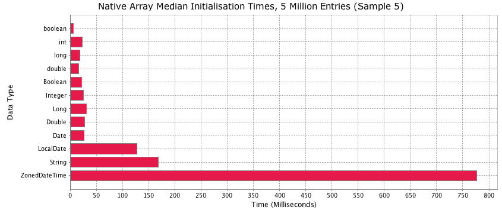
**Figure 1. Expect significant dispersion in initialization times for large non-primitive arrays**

While the variation in initialisation times appears to be fairly significant, the **magnitude** of the 
garbage collection (GC) times in figure 2 is potentially more concerning. The GC times for 
primitive arrays barely registers on this chart which is dominated by the results for `ZonedDateTime`. 
Primitive arrays are represented by a single object and a contiguous block of memory, so the 
collector only needs to keep track of one reference when performing its sweep. Clearly this makes
a profound difference in performance.
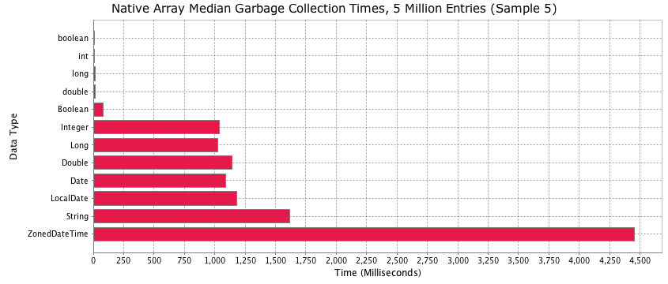
**Figure 2. ZonedDateTime has a great API for time zone aware dates, but it comes at a price**

Using the `Instrumentation` interface introduced in Java 5, we estimate the relative sizes
of these various array instances, and once again, primitive arrays win hands down. Notice how 
the `Date` array consumes more than twice the memory of a primitive `long` array of the same 
length, even though its internal state is no more than a single `long` field representing epoch 
milliseconds. Also, it appears that the boxed versions of the `boolean`, `int`, `long` and `double`
arrays use at least 3 times more memory.

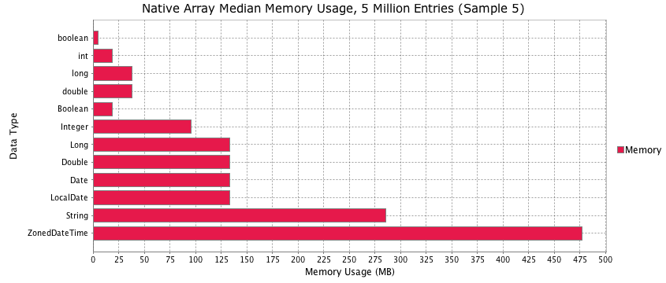
**Figure 3. The boxed versions of the arrays appear to take more than 2-3 times the memory of their primitive counterparts**

There is work underway at Oracle to address some of these issues, however it is not yet clear
which future Java release, if any, will include some of the changes discussed [here](http://cr.openjdk.java.net/~jrose/pres/201207-Arrays-2.pdf).

---

### Morpheus Arrays

#### Motivation

The moral of the story above is that to build high performance systems involving large data, 
primitive arrays have to be used wherever possible, which is the fundamental design motivation 
behind the Morpheus Array package. 

This is by no means an attempt to compete with excellent primitive collections libraries such as 
[Trove](http://trove.starlight-systems.com/) and [Goldman Sachs Collections](https://github.com/goldmansachs/gs-collections), 
and in fact, sparse implementations of Morpheus arrays use the Trove library internally. The 
Morpheus Array interface is a much more narrowly focused data structure, whose design was ultimately 
motivated by the desire to build an efficient in-memory column store called a `DataFrame`.
 
The Morpheus library ships with a number of implementations of the `com.zavtech.morpheus.array.Array` 
interface, with support for many commonly used types. Each implementation is designed to unbox an object 
into an appropriate primitive representation where possible, and box it when it is being read back from 
the array. So for example, `Array<Date>` internally contains a primitive array of longs which store epoch 
millisecond values. `Array<String>` represents its internal state with a large `char`array, and unboxes 
strings to store their contents at an appropriate location within this large `char` array. Additional
`char` arrays are created if the size exceeds Integer.MAX_VALUE.

#### Design Compromise

This design choice is obviously a compromise in that it introduces a boxing/unboxing cost when reading
and writing elements against a Morpheus array. While this is true, for the most part it turns out to be 
a favorable compromise with more benefits than drawbacks, because it plays to the strengths
of the Java Virtual Machine. Specifically, it is sympathetic to the fundamental design philosophy 
of generational garbage collection algorithms, which assume that most objects die young.
 
The plots below compare the same performance statistics discussed in the previous section in order to get 
a sense of how Morpheus arrays compare to their native counterparts. As expected, the first chart suggests 
that Morpheus arrays are somewhat slower to initialize, although not alarmingly so. This differential in
performance is not unexpected, even for the cases where no unboxing is required, as a method call 
is necessary to set the value unlike the [] operator for native arrays. 
 
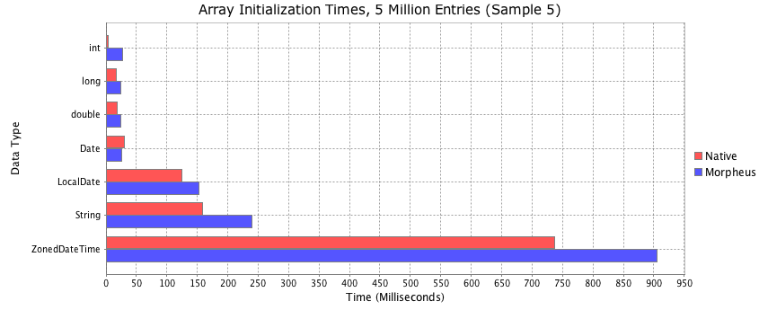
**Figure 4. Morpheus arrays are slightly slower to initialise, but not alarmingly so - there is payback for the effort**

There is a huge return on the investment made to keep everything as primitives however, and the subsequent 
garbage collection times for Morpheus arrays is a small fraction compared to non-primitive native arrays.
Figure 5 is the same plot as figure 4, but including the subsequent GC times to deallocate the array
created in each test. So while you pay a small performance penalty with respect to initialisation, the 
massive reduction in the GC load easily offsets this. Considering the _magnitude_ of the native object 
array GC times, it feels like a good trade.

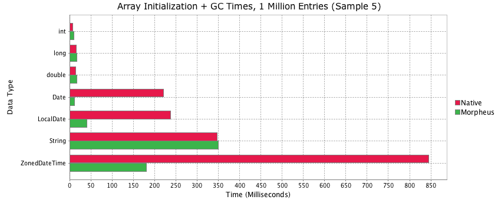
**Figure 5. Morpheus arrays which are based on primitives internally, are very friendly to the garbage collector**

There is also a material reduction in the amount of memory required to store Morpheus arrays. Notice the huge 
drop in memory required to represent a `ZonedDateTime` array, or at least the equivalent information within a Morpheus 
array. Clearly it is not possible to improve on the allocated memory for primitive types, but in these cases
Morpheus arrays match their native counterparts.

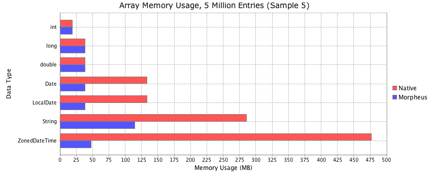
**Figure 6. Morpheus arrays use significantly less memory than their object counterparts**

#### Iteration & Boxing

Significantly reduced memory usage and much faster Garbage Collection times in return for slightly slower 
initialization appears to be a reasonable compromise. Sadly, that does not fully represent the extent of the
trade-off here, as iteration times on some Morpheus arrays is likely to be slower, at least in cases where 
each element access requires boxing. For `boolean`, `int`, `long` and `double`array types this is obviously 
not an issue, but for other types there is likely to be a cost.

The results in figure 7 illustrate this performance deficit for a Morpheus `LocalDateTime` array versus its
native counterpart. In both sequential and parallel iteration, the boxing cost appears to roughly double 
the iteration times in these examples. While that sounds bad, consider the results in figure 8, which are for 
the same test, but in that example the subsequent Garbage Collection times incurred after each test is 
included. This presents a very different picture. In addition, iterating over a Morpheus array in parallel 
is trivial and a fluent extension of the API, and in this mode, it appears that you double the performance 
of native sequential execution on a Quad-Core machine. 

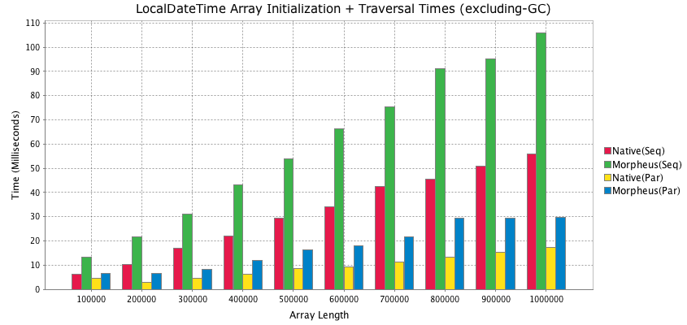
**Figure 7. Morpheus boxing & unboxing does come at a cost, but figure 8 shows the payoff**

Including the subsequent GC times after each test paints a very different picture. This also helps to 
demonstrate the fact that the design compromise in the Morpheus library is sympathetic to the garbage collector, 
because the boxing of dates during array traversal results in very short lived objects that are stack based. In 
the native examples, the objects survive far longer and are heap based, thus placing a much bigger burden on 
the collector. So while the number of objects created in each test is roughly equivalent, the native examples 
take far longer overall.

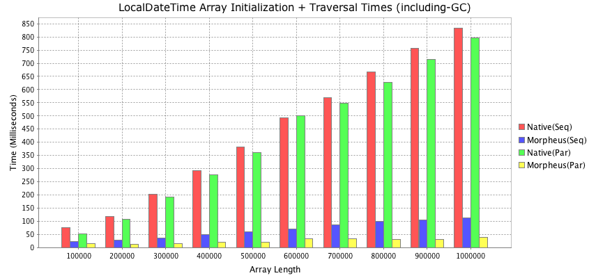
**Figure 8. Including GC times completely changes the picture, and Morpheus proves much faster overall**

The code to generate the plots in figure 7 and 8 is as follows:

<?prettify?>
```
final int sample = 5;
final boolean includeGC = false;

Range<Integer> arrayLengths = Range.of(1, 11).map(i -> i * 100000);
Array<String> labels = Array.ofStrings("Native(Seq)", "Morpheus(Seq)", "Native(Par)", "Morpheus(Par)");
DataFrame<String,String> results = DataFrame.ofDoubles(arrayLengths.map(String::valueOf), labels);

arrayLengths.forEach(arrayLength -> {

    DataFrame<String,String> timing = PerfStat.run(sample, TimeUnit.MILLISECONDS, includeGC, tasks -> {

        tasks.put("Native(Seq)", () -> {
            final AtomicInteger count = new AtomicInteger();
            final LocalDateTime start = LocalDateTime.now().minusYears(5);
            final LocalDateTime[] array = new LocalDateTime[arrayLength];
            for (int i=0; i<array.length; ++i) {
                array[i] = start.plusMinutes(i);
            }
            for (LocalDateTime value : array) {
                if (value.getDayOfWeek() == DayOfWeek.MONDAY) {
                    count.incrementAndGet();
                }
            }
            return array;
        });

        tasks.put("Morpheus(Seq)", () -> {
            final AtomicInteger count = new AtomicInteger();
            final LocalDateTime start = LocalDateTime.now().minusYears(5);
            final Array<LocalDateTime> array = Array.of(LocalDateTime.class, arrayLength);
            array.applyValues(v -> start.plusMinutes(v.index()));
            array.forEach(value -> {
                if (value.getDayOfWeek() == DayOfWeek.MONDAY) {
                    count.incrementAndGet();
                }
            });
            return array;
        });

        tasks.put("Native(Par)", () -> {
            final AtomicInteger count = new AtomicInteger();
            final LocalDateTime start = LocalDateTime.now().minusYears(5);
            final IntStream indexes = IntStream.range(0, arrayLength).parallel();
            final Stream<LocalDateTime> dates = indexes.mapToObj(start::plusMinutes);
            final LocalDateTime[] array = dates.toArray(LocalDateTime[]::new);
            Stream.of(array).parallel().forEach(value -> {
                if (value.getDayOfWeek() == DayOfWeek.MONDAY) {
                    count.incrementAndGet();
                }
            });
            return array;
        });

        tasks.put("Morpheus(Par)", () -> {
            final AtomicInteger count = new AtomicInteger();
            final LocalDateTime start = LocalDateTime.now().minusYears(5);
            final Array<LocalDateTime> array = Array.of(LocalDateTime.class, arrayLength);
            array.parallel().applyValues(v -> start.plusMinutes(v.index()));
            array.parallel().forEach(value -> {
                if (value.getDayOfWeek() == DayOfWeek.MONDAY) {
                    count.incrementAndGet();
                }
            });
            return array;
        });

    });

    String label = String.valueOf(arrayLength);
    results.data().setDouble(label, "Native(Seq)", timing.data().getDouble("Mean", "Native(Seq)"));
    results.data().setDouble(label, "Morpheus(Seq)", timing.data().getDouble("Mean", "Morpheus(Seq)"));
    results.data().setDouble(label, "Native(Par)", timing.data().getDouble("Mean", "Native(Par)"));
    results.data().setDouble(label, "Morpheus(Par)", timing.data().getDouble("Mean", "Morpheus(Par)"));

});

//Create title from template
final String prefix = "LocalDateTime Array Initialization + Traversal Times";
final String title = prefix + (includeGC ? " (including-GC)" : "(excluding-GC)");

//Record chart to file
final String fileSuffix = includeGC ? "2.png" : "1.png";
final String filePrefix = "./morpheus-docs/docs/images/native-vs-morpheus-array-sequential-vs-parallel";

//Plot results as a bar chart
Chart.of(results, chart -> {
    chart.plot(0).withBars(0d);
    chart.title().withText(title);
    chart.title().withFont(new Font("Verdana", Font.PLAIN, 15));
    chart.axes().domain().label().withText("Array Length");
    chart.axes().range(0).label().withText("Time (Milliseconds)");
    chart.legend().on();
    chart.writerPng(new File(filePrefix + fileSuffix), 845, 400);
    chart.show();
});
```


#### Sorting

This section compares some performance statistics of sorting large Morpheus arrays versus their 
native counterparts. The Morpheus library is built around the highly versatile array sorting API 
in [FastUtil](http://fastutil.di.unimi.it/) developed by [Sebastiano Vigna](http://vigna.di.unimi.it/).
The results below compare performance versus the JDK `java.util.Arrays.sort()` and `parallelSort()` 
functions, which it has to be said, is not an entirely fair benchmark.
 
Firstly, the JDK array sorting algorithm is based on a dual-pivot quick sort whereas FastUtil is based
on a more traditional single-pivot quick sort. Secondly, the JDK implementation is presented with
the array directly, allowing everything to be inlined, and also enabling sliced work arrays to
be constructed as required. FastUtil on the other hand is not presented with the data directly, 
but interacts with it via an `IntComparator` and `Swapper`, which does incur method call over head, 
but also makes it far more versatile. The JDK sorting functionality is limited to only sorting arrays 
in their natural order, while FastUtil allows the sorting logic to be fully customized.

The results in Figure 9 and 10 demonstrate two very different outcomes, the former comparing performance
on a primitive `double` array, the latter on an `LocalDateTime` array (in both cases these arrays are
randomized before the tests are run). In the case of the double array, the JDK `Arrays` implementation
appears to offer roughly twice the performance of FastUtil as used in Morpheus. For the `LocalDateTime`
test, the tables are turned, and FastUtil vastly outperforms the native `Arrays` call, and these times
do not include any garbage collection costs incurred after the each test is completed.

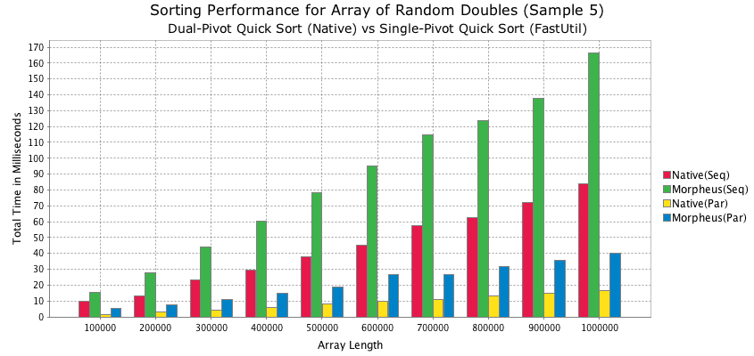
**Figure 9. Sorting times for an array of 10 million random double precision values**

In the `LocalDatTime` results below, Morpheus far outperforms the native array because it is only 
operating on the internal primitive array of longs. No boxing is required here, so hence the vast
performance gap. While this is not an entirely fair comparison, it demonstrates the benefits of
storing everything as primitives. 

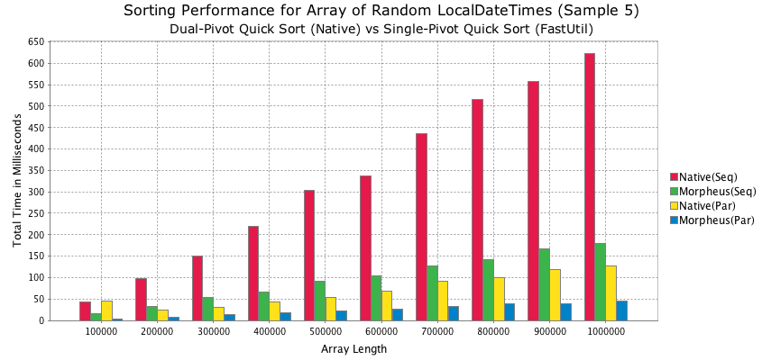
**Figure 10. Same test as in figure 9, but using an array of randomly ordered LocalDateTimes**

The code to generate the results in figure 9 is as follows:

<?prettify?>
```
Range<Integer> arrayLengths = Range.of(1, 11).map(i -> i * 100000);
Array<String> labels = Array.ofStrings("Native(Seq)", "Morpheus(Seq)", "Native(Par)", "Morpheus(Par)");
DataFrame<String,String> results = DataFrame.ofDoubles(arrayLengths.map(String::valueOf), labels);

arrayLengths.forEach(length -> {

    System.out.println("Running sort test for array length " + length);
    double[] array1 = new double[length];
    Array<Double> array2 = Array.of(Double.class, length);

    DataFrame<String,String> timing = PerfStat.run(sample, TimeUnit.MILLISECONDS, false, tasks -> {
        tasks.put("Native(Seq)", () -> { Arrays.sort(array1); return array1; });
        tasks.put("Morpheus(Seq)", () -> array2.sort(true) );
        tasks.put("Native(Par)", () -> { Arrays.parallelSort(array1); return array1; });
        tasks.put("Morpheus(Par)", () -> array2.parallel().sort(true));
        tasks.beforeEach(() -> {
            array2.applyDoubles(v -> Math.random());
            array2.forEachValue(v -> array1[v.index()] = v.getDouble());
        });
    });

    String label = String.valueOf(length);
    results.data().setDouble(label, "Native(Seq)", timing.data().getDouble("Mean", "Native(Seq)"));
    results.data().setDouble(label, "Morpheus(Seq)", timing.data().getDouble("Mean", "Morpheus(Seq)"));
    results.data().setDouble(label, "Native(Par)", timing.data().getDouble("Mean", "Native(Par)"));
    results.data().setDouble(label, "Morpheus(Par)", timing.data().getDouble("Mean", "Morpheus(Par)"));
});

Chart.of(results, chart -> {
    chart.plot(0).withBars(0d);
    chart.title().withText("Sorting Performance for Array of Random Doubles (Sample " + sample + ")");
    chart.title().withFont(new Font("Verdana", Font.PLAIN, 16));
    chart.subtitle().withText("Dual-Pivot Quick Sort (Native) vs Single-Pivot Quick Sort (FastUtil)");
    chart.subtitle().withFont(new Font("Verdana", Font.PLAIN, 14));
    chart.axes().domain().label().withText("Array Length");
    chart.axes().range(0).label().withText("Total Time in Milliseconds");
    chart.legend().on();
    chart.writerPng(new File("./morpheus-docs/docs/images/array-sort-native-vs-morpheus-1.png"), 845, 400);
    chart.show();
});
```

#### Summary Statistics

Morpheus provides an API to calculate various descriptive statistics on numerical arrays, such
as min, max, variance, skew, kurtosis, auto correlation and so on. The chart below shows the
calculation times for these quantities on a Morpheus array of 10 million random double precision
values. The code used to generate this plot is also included.

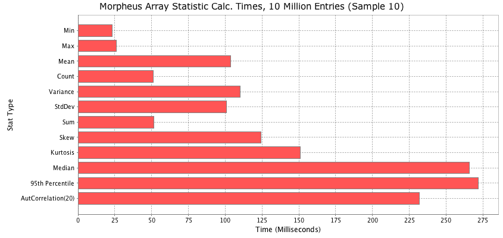
**Figure 11. Calculation times for various summary statistics on a Morpheus array with 10 million elements**

The code to generate these results is as follows:

<?prettify?>
```
final int count = 10;
final int size = 10000000;
final Array<Double> array = Array.of(Double.class, size).applyDoubles(v -> Math.random() * 100);

final DataFrame<String,String> times = PerfStat.run(count, TimeUnit.MILLISECONDS, true, tasks -> {
    tasks.put("Min", () -> array.stats().min());
    tasks.put("Max", () -> array.stats().max());
    tasks.put("Mean", () -> array.stats().mean());
    tasks.put("Count", () -> array.stats().count());
    tasks.put("Variance", () -> array.stats().variance());
    tasks.put("StdDev", () -> array.stats().stdDev());
    tasks.put("Sum", () -> array.stats().sum());
    tasks.put("Skew", () -> array.stats().skew());
    tasks.put("Kurtosis", () -> array.stats().kurtosis());
    tasks.put("Median", () -> array.stats().median());
    tasks.put("95th Percentile", () -> array.stats().percentile(95));
    tasks.put("AutCorrelation(20)", () -> array.stats().autocorr(20));
});

Chart.of(times.rows().select("Mean").transpose(), chart -> {
    chart.plot(0).withBars(0d);
    chart.title().withText("Morpheus Array Statistic Calculation Times, 10 Million Entries (Sample 10)");
    chart.title().withFont(new Font("Verdana", Font.PLAIN, 15));
    chart.axes().domain().label().withText("Stat Type");
    chart.axes().range(0).label().withText("Time (Milliseconds)");
    chart.legend().off();
    chart.orientation().horizontal();
    chart.writerPng(new File("./morpheus-docs/docs/images/morpheus-stat-times.png"), 845, 400);
    chart.show();
});
```